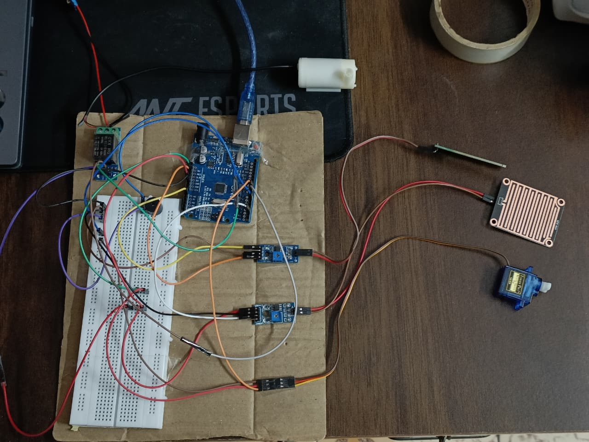

# Rain-Based-Clothes-Protector-Smart-Irrigation 🌧️🌱

This project combines **two automation systems using a single Arduino**:

1. **Rain Detection Clothes Protector**
   - Detects rain using a rain sensor module
   - Automatically rotates a servo motor to hide clothes from rain

2. **Automatic Irrigation System**
   - Measures soil moisture using a soil moisture sensor
   - If soil is dry, a water pump is turned ON using a relay module
   - A buzzer alerts when the pump is ON

---

## 📌 Features

✅ Rain detection based clothes protection using servo motor  
✅ Soil moisture based irrigation using relay + pump  
✅ Buzzer alert when irrigation is active  
✅ Both systems work independently on one Arduino

---
## 📸 Project Images

### Setup

---

## 🧰 Components Required

### Controller
- Arduino Uno 

### Rain + Clothes Protection System
- Rain Sensor Module (FC-37 / YL-83) (1)
- Servo Motor (SG90) (1)

### Irrigation System
- Soil Moisture Sensor Module (FC-28 or Capacitive) (1)
- 1-Channel Relay Module (5V) (1)
- Submersible DC Water Pump (5V / 12V) (1)
- External power supply for pump (based on pump voltage)

### Alert
- Active buzzer (1)

### Other
- Jumper wires
- Breadboard (optional)
- Water tank + pipe

---

## 🔌 Arduino Pin Connections

### 🌧️ Rain Sensor
| Rain Sensor Pin | Arduino Pin |
|---------------|------------|
| DO | D2 |
| VCC | 5V |
| GND | GND |

---

### 🔄 Servo Motor (Clothes Protector)
| Servo Wire | Arduino Pin |
|-----------|------------|
| Signal (Orange/Yellow) | D9 |
| VCC (Red) | 5V |
| GND (Brown/Black) | GND |

> ⚠️ Recommended: If servo jitters, power it using an external 5V supply.  
> (Keep Arduino GND and servo supply GND connected.)

---

### 🌱 Soil Moisture Sensor
| Soil Sensor Pin | Arduino Pin |
|----------------|------------|
| AO | A0 |
| VCC | 5V |
| GND | GND |

---

### 🔊 Buzzer
| Buzzer Pin | Arduino Pin |
|-----------|------------|
| + | D6 |
| - | GND |

---

### ⚡ Relay Module
| Relay Module Pin | Arduino Pin |
|-----------------|------------|
| IN | D8 |
| VCC | 5V |
| GND | GND |

---

## 💧 Pump Wiring (Relay Power Side)

Relay screw terminals:
- **COM** = Common
- **NO** = Normally Open (OFF by default)
- **NC** = Normally Closed (ON by default)

### ✅ Use COM + NO (recommended)

Connect like this:

- Pump Power Supply **+** → Relay **COM**
- Relay **NO** → Pump **+**
- Pump **-** → Pump Power Supply **-**

This makes the pump:
- OFF normally
- ON only when Arduino activates relay

---

## ⚙️ Working Explanation

### 1) Rain Clothes Protector
- If rain is detected, servo rotates to 90° to hide clothes
- If no rain, servo returns to 0°

### 2) Automatic Irrigation
- Soil moisture sensor gives analog values (0–1023)
- Usually:
  - **Low value = wet soil**
  - **High value = dry soil**
- If soil is dry:
  - Relay ON → Pump ON
  - Buzzer ON

---

## 🧪 Calibration (Very Important)

Open Serial Monitor at **9600 baud** and check soil values:

- Put sensor in water → note value (example: ~170)
- Put sensor in dry soil → note value (example: ~800)

Set the threshold between wet and dry.

Example:
- Wet = 170
- Dry = 800
- Threshold can be around **400–600**

---

## 🧾 Code

The main Arduino code is inside:

`src/smart_system.ino`

---

## 🚀 How to Run

1. Make all hardware connections
2. Upload the code to Arduino
3. Open Serial Monitor (9600 baud) to view soil values
4. Test:
   - Sprinkle water on rain sensor → servo should move
   - Dry soil sensor → pump ON + buzzer ON
   - Wet soil sensor → pump OFF + buzzer OFF

---

## 🔮 Future Improvements
- Add LCD/OLED display
- Add IoT using ESP8266/ESP32
- Add manual override switch
- Add rain delay irrigation feature
- Log soil values to SD card

---

## 👤 Author
**Sabeer G**
